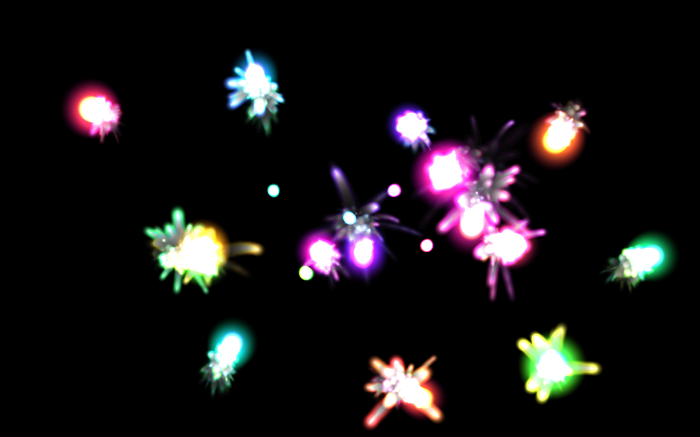
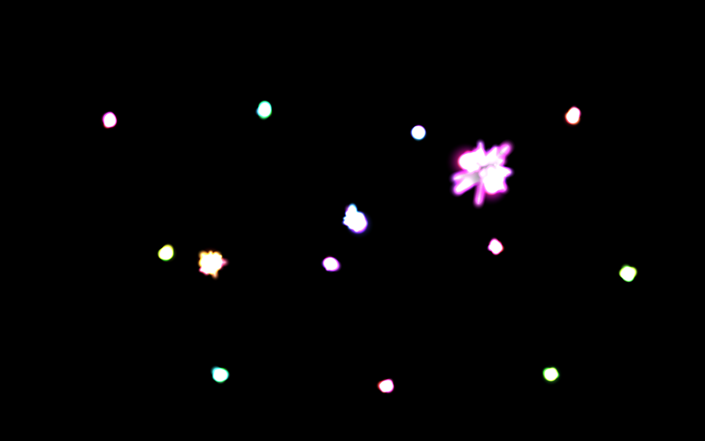
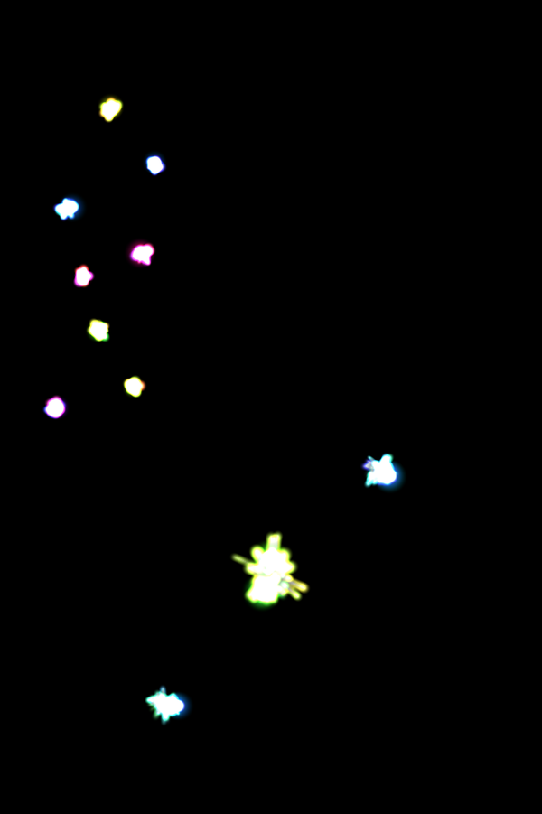

# 線香花火 / Senko Hanabi

<p align="center">
  
</p>

<p align="center">
  <strong>夜に灯る、儚い光の Canvas SPA。</strong><br>
  火種が枝分かれし、色を変え、火花を散らしながら、自分のリズムで増えたり減ったりする。
</p>

<p align="center">
  <a href="https://yamadar.github.io/senko-hanabi/"><strong>▶ ブラウザで開く（ライブデモ）</strong></a>
</p>

---

## このアプリで何が起きるか

開くと、3つの火種が画面の真ん中あたりに灯る。ほうっておいても勝手に分裂し、色を変え、火花を撒き続ける。**画面をクリック / タップ**すれば、その場所に新しい火種が生まれる。

<p align="center">
  
</p>

火種は **成長 → 縮小** のライフサイクルを持ち、ふらつきながら移動する。ときどき確率で**2つに枝分かれ**し、色相を子に受け継ぐ。同時に存在できる火種の上限は**90秒周期でゆらぎ**、密度に緩急が出る。寂しくなると長寿命の予備が自動投入されるので、開きっぱなしで眺めていても飽きない。

スマホでも軽快に動く（実機は縦持ち推奨）。

<p align="center">
  
</p>

## 技術的なみどころ

- **依存ゼロ寄り** — 本体は vanilla JS。Vite 6（dev / build）と Vitest 3（テスト）のみ
- **色相別スプライト事前焼き込み** — `createRadialGradient` を毎フレーム呼ばず、起動時に 18 色相 × 4 種を 1 回だけ生成
- **加算合成 + 残像** — `globalCompositeOperation = 'lighter'` で発光感を、半透明黒の塗りで残像を作る
- **純粋ロジックは Vitest でテスト** — イージング、寿命減衰、分裂確率などは DOM 非依存の純関数として 49 件のテストで担保
- **モジュール分離** — `math.js` / `spark.js` / `sparkler.js` / `sprites.js` / `config.js` / `main.js` に責務を分け、`main.js` は薄いエントリに留める

設計の詳細は [`docs/ARCHITECTURE.md`](./docs/ARCHITECTURE.md) にまとめてある。

## ローカルで動かす

```bash
npm install
npm run dev          # http://localhost:5185/ が自動で開く
npm test             # Vitest で 49 件のユニットテストを実行
npm run build        # dist/ に静的ファイルを出力
```

Node のバージョンは [`.nvmrc`](./.nvmrc) を参照。

## デプロイ

`main` ブランチへの push で GitHub Pages に自動デプロイされる（[`.github/workflows/deploy.yml`](./.github/workflows/deploy.yml)）。

## ライセンス

[MIT](./LICENSE)
